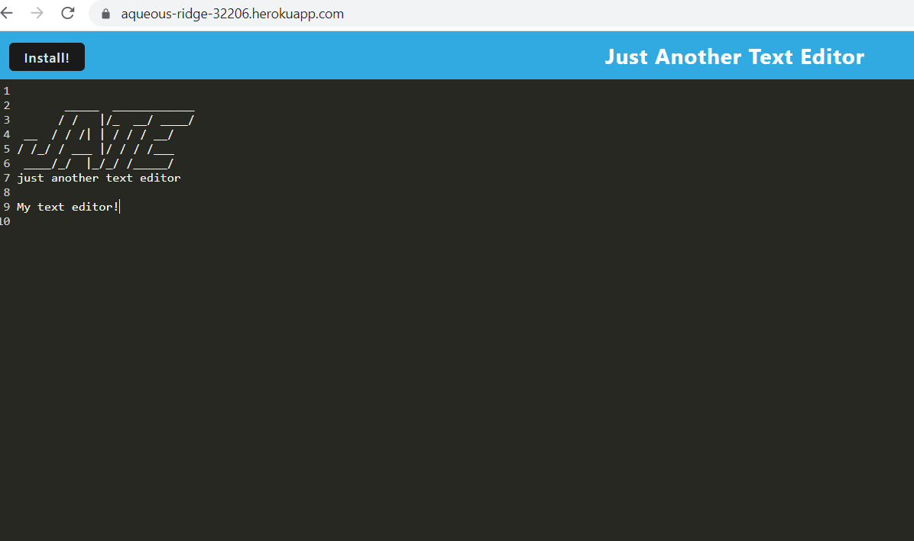

# Text Editor
## Table of Contents
[description](#description)
[installation](#installation)
[license](#license)
[usage](#usage)
[contribution](#contribution)
[questions](#questions) 

## Description 
This Single Page Application (SPA) runs in your browser and meets Progressive Web Applications (PWA) criteria.  It is built with data persistence techniques and will function offline.  
## Badges

## Installation
This application has been deployed on heroku.  See URL below.  If downloaded, please be attentive to keeping its folder structure.
## License
MIT
## Usage
This is a text editor that functions in your browser.
## Contribution
Todd Trulock helped me with its deployment.
## Questions 
###   GitHub Username:  cnc500
###   GitHub Repository:  textEditor
###   Email:  cncarnevale@gmail.com
## URL
https://aqueous-ridge-32206.herokuapp.com/

## Screenshot

